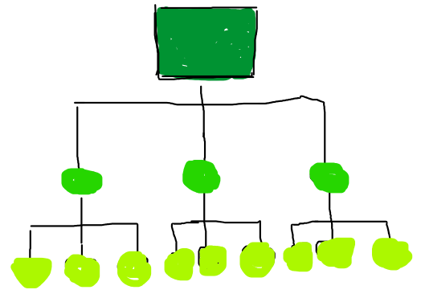

# Hierarchy - a natural order?

By Sophia Mayer

15.03.2022

---

### Definition of hierarchy

“A system in which people or things are arranged according to their importance”

---

### What is a hierarchy

- has its origin in Greek
- each person has his or her precisely defined rights, powers, and responsibilities
- hierarchy can be understood as a pyramid
  - at the top are the highest-ranking people, at the bottom are those with the lowest rank

---

### Hierarchy chart

---

### Why do we need hierarchy

The fewer levels of hierarchy there are, the flatter the order is referred to

Various types are hidden in the economic sense:

- Task hierarchy
- Job hierarchy
- Person hierarchy
- Target hierarchy

---

**_Is hierarchy really a natural order?_**
