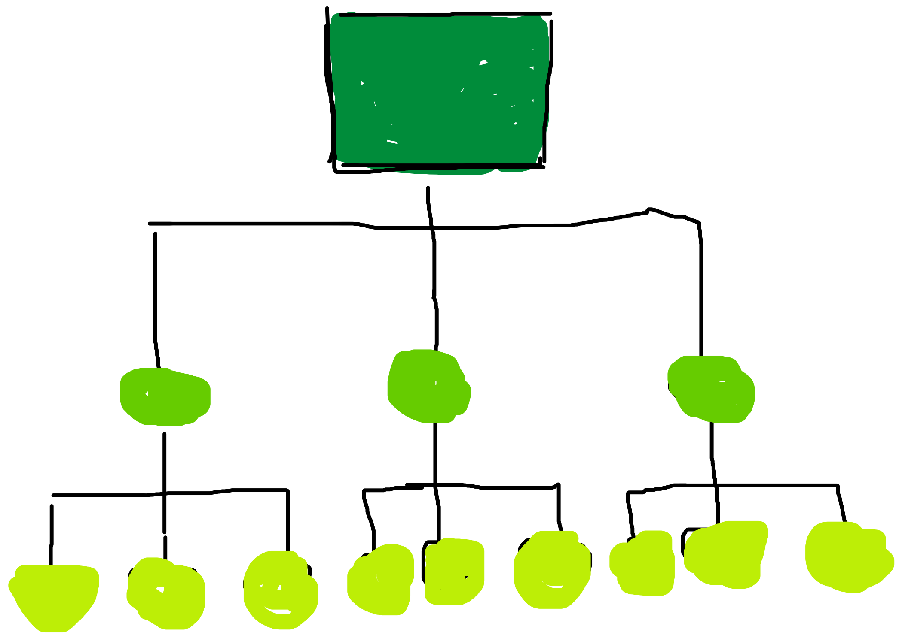
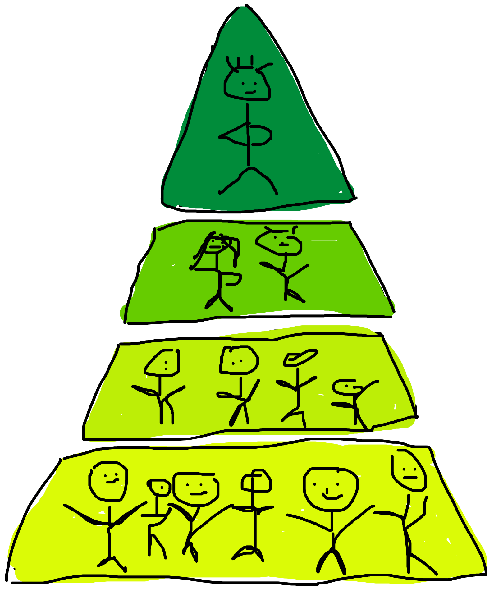
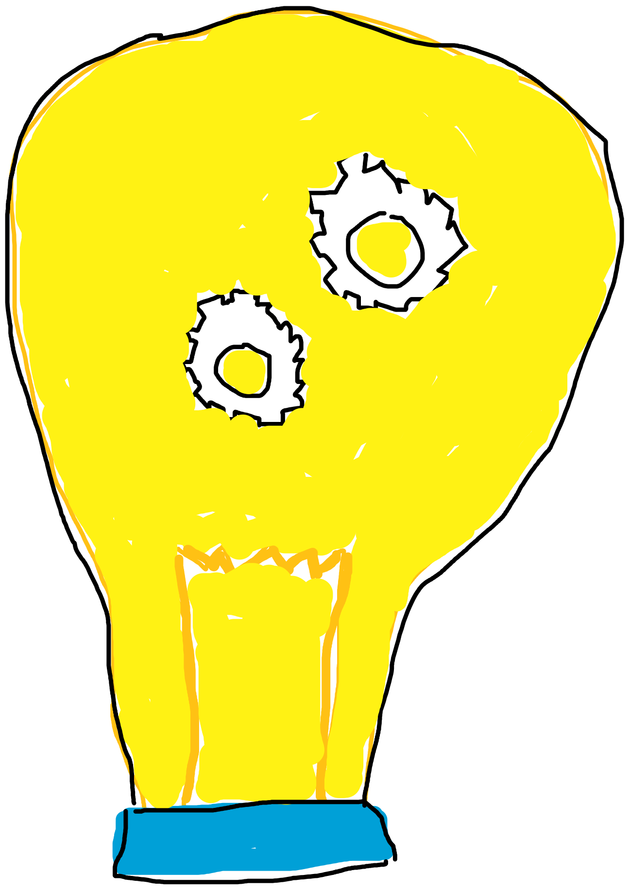
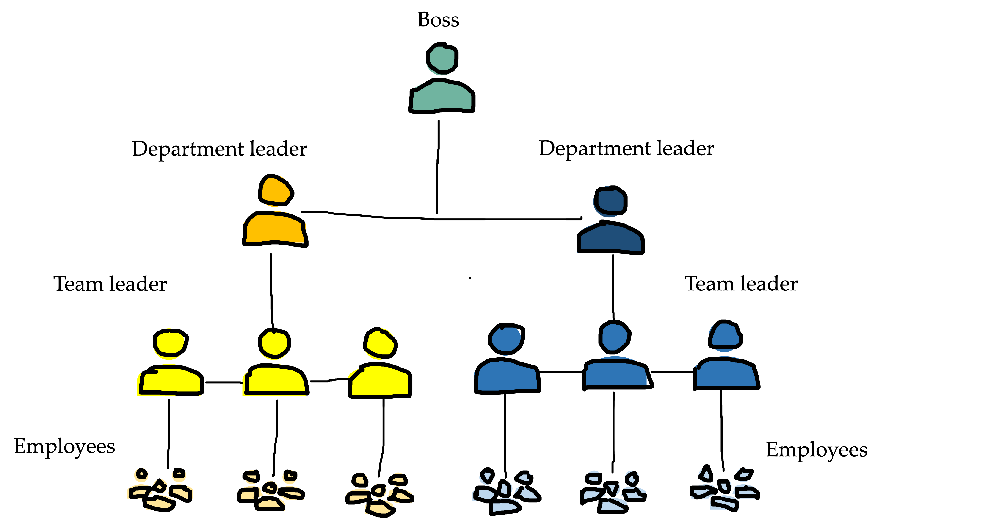
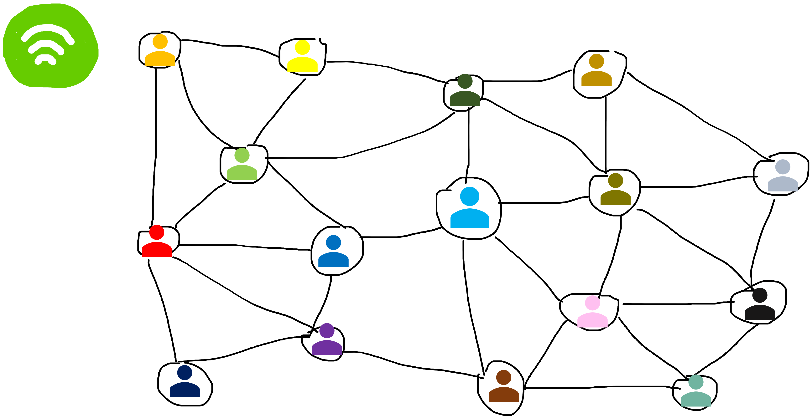
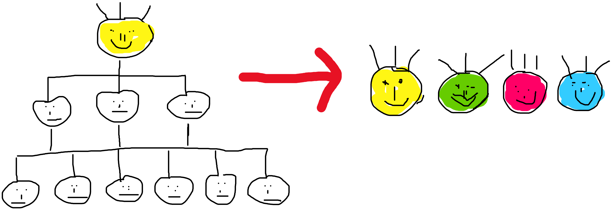

## Hierarchy - a natural order?

By Sophia Mayer

15.03.2022

---

### Definition of hierarchy

“A system in which people or things are arranged according to their importance”

---

### What exactly is a hierarchy?

- has its origin in Greek
- each person has his or her precisely defined rights, powers, and responsibilities
- hierarchy can be understood as a pyramid

  - at the top are the highest-ranking people, at the bottom are those with the lowest rank

 

  

---

### How is hierarchy being used?

<b>Hierarchy</b>  &rarr;  From the Catholic Church to states, from the military to most private organizations, we see these pyramid-like organizations everywhere, to the point that many assume that hierarchy is a "natural order 

---

### Origin of the hierarchy

<b></b> &rarr; Many species tend to form hierarchies in nature 

---

### Is hierarchy really a natural order?

| **_Example Military_**                                |                  **_Example Women_**                   |
| ----------------------------------------------------- | :----------------------------------------------------: |
|  |  |

---

#### An organization for a rapidly changing environment must be a form of networks

| **_More_**        | **_Less_**  |
| ----------------- | :---------- |
| Collaboration     | Management  |
| Opportunity space | Hierarchy   |
| Emotionality      | Rules       |
| Confidence        | Complacency |

---

### Hierarchy in the digital age

<b></b>  &rarr; In the digital age, however, a multitude of disruptive market players are challenging traditional companies and changing entire industries &rarr; increased degree of autonomy and flexibility in organizational design 

---

### Disruptive innovation ideas need flat hierarchies

- enables them to exploit the diverse potential for change in the digital world
- achieve disproportionate output
  - often up to ten times higher than traditional, so-called linear companies

---

#### Instead of strictly striving for efficiency, the focus today is on rapid adaptability

In order to take advantage of the disruptive potential in a digital world and remain competitive

  

---

##### "Spotify's success is largely based on the application of flexible concepts in organizational design and the consistent use of agile ways of working"

---

### What can we take away from this?

- Every organization begins its order with the classic idea of hierarchy
- this hierarchy idea can no longer be implemented well in this way and a different, more agile set-up is required

---

**What do you now think of when you hear the term hierarchy?**
