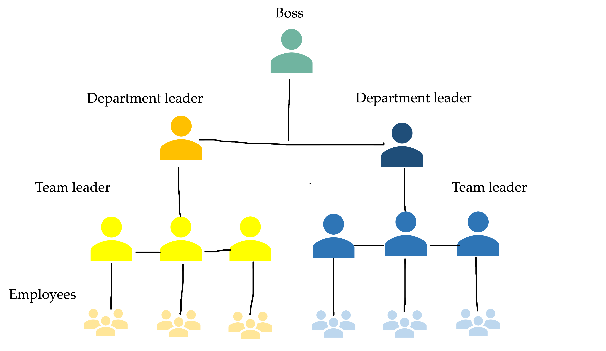

## Hierarchy - a natural order?

By Sophia Mayer

15.03.2022

---

### Definition of hierarchy

“A system in which people or things are arranged according to their importance”

---

### What exactly is a hierarchy?

- has its origin in Greek
- each person has his or her precisely defined rights, powers, and responsibilities
- hierarchy can be understood as a pyramid

  - at the top are the highest-ranking people, at the bottom are those with the lowest rank

 

  

---

### How is hierarchy be used?

<b>Hierarchy</b>  &rarr;  From the Catholic Church to states, from the military to most private organizations, we see these pyramid-like organizations everywhere, to the point that many assume that hierarchy is a "natural order 

---

### Origin of the hierarchy

<b></b> &rarr; Many species tend to form hierarchies in nature 

---

### Is hierarchy really a natural order?

| **_Example Military_**                                |                  **_Example Women_**                   |
| ----------------------------------------------------- | :----------------------------------------------------: |
|  |  |

---

| More              | Less        |
| ----------------- | :---------- |
| Collaboration     | Management  |
| Opportunity space | Hierarchy   |
| Emotionality      | Rules       |
| Confidence        | Complacency |

---

### Hierarchy in the digital age

The fewer levels of hierarchy there are, the flatter the order is referred to

Various types are hidden in the economic sense:

- Task hierarchy
- Job hierarchy
- Person hierarchy
- Target hierarchy

---

### Test

---

**_Is hierarchy really a natural order?_**

---

| Tables        |      Are      |  Cool |
| ------------- | :-----------: | ----: |
| col 3 is      | right-aligned | $1600 |
| col 2 is      |   centered    |   $12 |
| zebra stripes |   are neat    |    $1 |

---

| This is about Hierarchy                                                   |                            |
| ------------------------------------------------------------------------- | -------------------------- |
| I am text to the left but I think the text could be a bit higher honestly |  |
