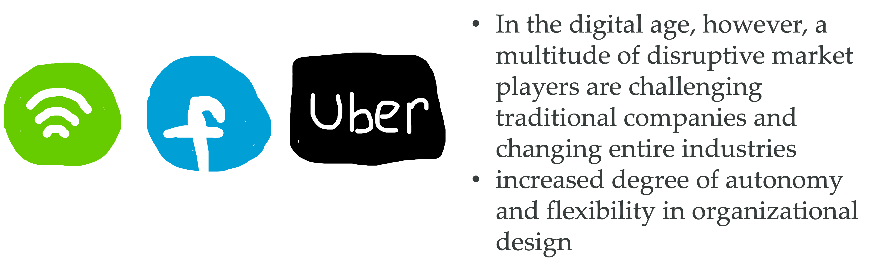

## Hierarchy - a natural order?

By Sophia Mayer

15.03.2022

---

### Definition of hierarchy

“A system in which people or things are arranged according to their importance”

---

### What exactly is a hierarchy?

- has its origin in Greek
- each person has his or her precisely defined rights, powers, and responsibilities
- hierarchy can be understood as a pyramid

  - at the top are the highest-ranking people, at the bottom are those with the lowest rank

 

  

---

### How is hierarchy being used?

<b>Hierarchy</b>  &rarr; From the Catholic Church to states, from the military to most private organizations, we see these pyramid-like organizations everywhere, to the point that many assume that hierarchy is a "natural order 

---

### Origin of the hierarchy

<b></b> Many species tend to form hierarchies in nature 

---

### Hierarchical structures are an effective means of top-down communication

---

### Is hierarchy really a natural order?

| **_Example Military_**                                |                  **_Example Women_**                   |
| ----------------------------------------------------- | :----------------------------------------------------: |
|  |  |

---

### An organization for a rapidly changing environment must be a form of networks

| **_More_** | **_Less_** |
| ------------------------------------------- | :---------------------------------------- |
| Collaboration                               | Management                                |
| Opportunity space                           | Hierarchy                                 |
| Emotionality                                | Rules                                     |
| Confidence                                  | Complacency                               |

---

### Hierarchy in the digital age

<b></b>  &rarr; In the digital age, however, a multitude of disruptive market players are challenging traditional companies and changing entire industries &rarr; increased degree of autonomy and flexibility in organizational design 

---

### Hierarchy in the digital age

---

### Disruptive innovation ideas need flat hierarchies

- enables them to exploit the diverse potential for change in the digital world
- achieve disproportionate output
  - often up to ten times higher than traditional, so-called linear companies

---

#### Instead of strictly striving for efficiency, the focus today is on rapid adaptability

 In order to take advantage of the disruptive potential in a digital world and remain competitive 

  

---

#####  "Spotify's success is largely based on the application of flexible concepts in organizational design and the consistent use of agile ways of working" 

---

### What can we take away from this?

 In an extreme complex and changing environment, companies must flatten their organizations to stay agile and competitive towards costumers and potential employees 

---

**What do you now think of when you hear the term hierarchy?**

---

### Sources

- [Definition Hierarchy](https://dictionary.cambridge.org/de/worterbuch/englisch/hierarchy)  
- [Hierarchy as a strict order](https://www.bpb.de/kurz-knapp/lexika/das-junge-politik-lexikon/320484/hierarchie/)  
- [The hierarchy as a system of sensible task distribution](https://www.business-on.de/definition-hierarchie-die-hierarchie-als-system-der-sinnvollen-aufgabenverteilung-_id42534.html)  
- [Flat hierarchy: definition & advantages and disadvantages](https://axel-schroeder.de/flache-hierarchie-definition-vorteile-und-nachteile/?utm_referrer=https%3A%2F%2Fwww.google.com%2F&wdLOR=cA90443B7-1749-AE48-8182-64829FA4473D)  
- [7 Types of organizational structures](https://www.lucidchart.com/blog/de/arten-von-organisations-strukturen#Hierarchische%20Organisationsstruktur)  
- [Rethink organization](https://www2.deloitte.com/content/dam/Deloitte/de/Documents/human-capital/Organisation-neu-denken-flexible-organisationsmodelle-2018.pdf)
