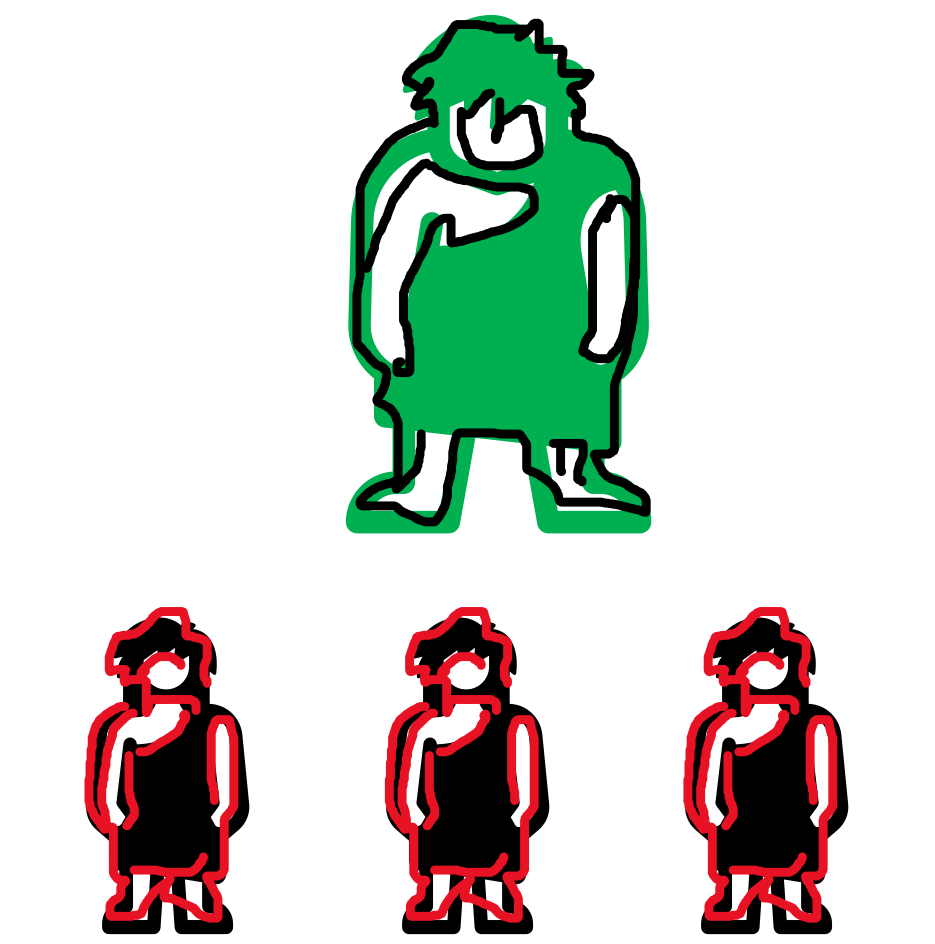
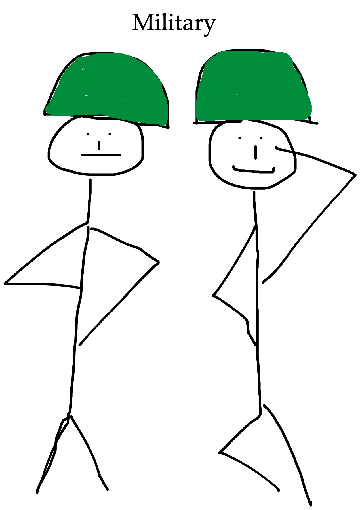

## Hierarchy - a natural order?

By Sophia Mayer

15.03.2022

---

### Agenda

1. Background information about hierarchy
2. How hierarchy is being used
3. Origin of hierarchy
4. Hierarchical Structures
5. Changes among hierarchy
6. Hierarchy in the digital age
7. Sources

---

### Definition of hierarchy

“A system in which people or things are arranged according to their importance”

---

### Background information about hierarchy

- has its origin in Greek
- each person has his or her precisely defined rights, powers, and responsibilities
- hierarchy can be understood as a pyramid
  - at the top are the highest-ranking people, at the bottom are those with the lowest rank

 

  

---

### How hierarchy is being used

<b>Hierarchy</b>  &rarr; From the Catholic Church to states, from the military to most private organizations, we see these pyramid-like organizations everywhere, to the point that many assume that hierarchy is a "natural order"

---

### Origin of hierarchy

&ndash; Many species tend to form hierarchies in nature  &ndash; The very principle of functional organization is not based on a hierarchy of power, but on a classification of activities

---

### Hierarchical structures are an effective means of top-down communication

---

### Is hierarchy really a natural order?

| **_Example Military_**                                |                  **_Example Women_**                   |
| ----------------------------------------------------- | :----------------------------------------------------: |
|  |  |

---

### An organization for a rapidly changing environment must be a form of networks

| **_More_** | **_Less_** |
| ------------------------------------------- | :---------------------------------------- |
| Collaboration                               | Management                                |
| Opportunity space                           | Hierarchy                                 |
| Emotionality                                | Rules                                     |
| Confidence                                  | Complacency                               |

---

### Hierarchy in the digital age

&ndash; In the digital age, however, a multitude of disruptive market players are challenging traditional companies and changing entire industries  &ndash; increased degree of autonomy and flexibility in organizational design

---

### Disruptive innovation ideas need flat hierarchies

- enables them to exploit the diverse potential for change in the digital world
- achieve disproportionate output
  - often up to ten times higher than traditional, so-called linear companies

---

### Instead of strictly striving for efficiency, the focus today is on rapid adaptability

In order to take advantage of the disruptive potential in a digital world and remain competitive

  

---

#####  "Spotify's success is largely based on the application of flexible concepts in organizational design and the consistent use of agile ways of working" 

---

### What can we take away from this?

 In an extreme complex and changing environment, companies must flatten their organizations to stay agile and competitive towards costumers and potential employees 

---

**Do you still think that hierarchies are natural?**

---

### Sources to directly click on it

- [Definition Hierarchy](https://dictionary.cambridge.org/de/worterbuch/englisch/hierarchy)  
- [Hierarchy as a strict order](https://www.bpb.de/kurz-knapp/lexika/das-junge-politik-lexikon/320484/hierarchie/)  
- [The hierarchy as a system of sensible task distribution](https://www.business-on.de/definition-hierarchie-die-hierarchie-als-system-der-sinnvollen-aufgabenverteilung-_id42534.html)  
- [Flat hierarchy: definition & advantages and disadvantages](https://axel-schroeder.de/flache-hierarchie-definition-vorteile-und-nachteile/?utm_referrer=https%3A%2F%2Fwww.google.com%2F&wdLOR=cA90443B7-1749-AE48-8182-64829FA4473D)  
- [7 Types of organizational structures](https://www.lucidchart.com/blog/de/arten-von-organisations-strukturen#Hierarchische%20Organisationsstruktur)  
- [Rethink organization](https://www2.deloitte.com/content/dam/Deloitte/de/Documents/human-capital/Organisation-neu-denken-flexible-organisationsmodelle-2018.pdf)

---

### Sources APA

&ndash; <strong>Caredda</strong>, S. (n.d.). Insights on Work, Organisation Design, Experience, Leadership and Change. <em>sergiocaredda.eu</em>. Retrieved 10/03/2022 from https://sergiocaredda.eu/organisation/the-true-meaning-of-hierarchy/. &ndash; <strong>Deloitte</strong> (2018). Organisation neu denken. <em>Deloitte</em>. Retrieved 10/03/2022 from https://www2.deloitte.com/content/dam/Deloitte/de/Documents/human-capital/Organisation-neu-denken-flexible-organisationsmodelle-2018.pdf. &ndash;  <strong>Pöhlmann</strong>, J. (n.d.). Flache Hierarchie: Definition & Vorteile und Nachteile. <em>Unternehmensberatung Axel Schröder</em>. Retrieved 10/03/2022 from https://axel-schroeder.de/flache-hierarchie-definition-vorteile-und-nachteile/. &ndash; <strong>Toyka-Seid</strong>, C. & Schneider, G. (2022). Hierarchie. <em>Bundeszentrale für politische Bildung</em>. Retrieved 10/03/2022 from https://www.bpb.de/kurz-knapp/lexika/das-junge-politik-lexikon/320484/hierarchie/. &ndash; <strong>Williams</strong>, S. (n.d.). 7 Arten von Organisationsstrukturen (+ Organigramme zur Implementierung). <em>Lucidchart</em>. Retrieved 10/03/2022 from https://www.lucidchart.com/blog/de/arten-von-organisations-strukturen#Hierarchische%20Organisationsstruktur.

